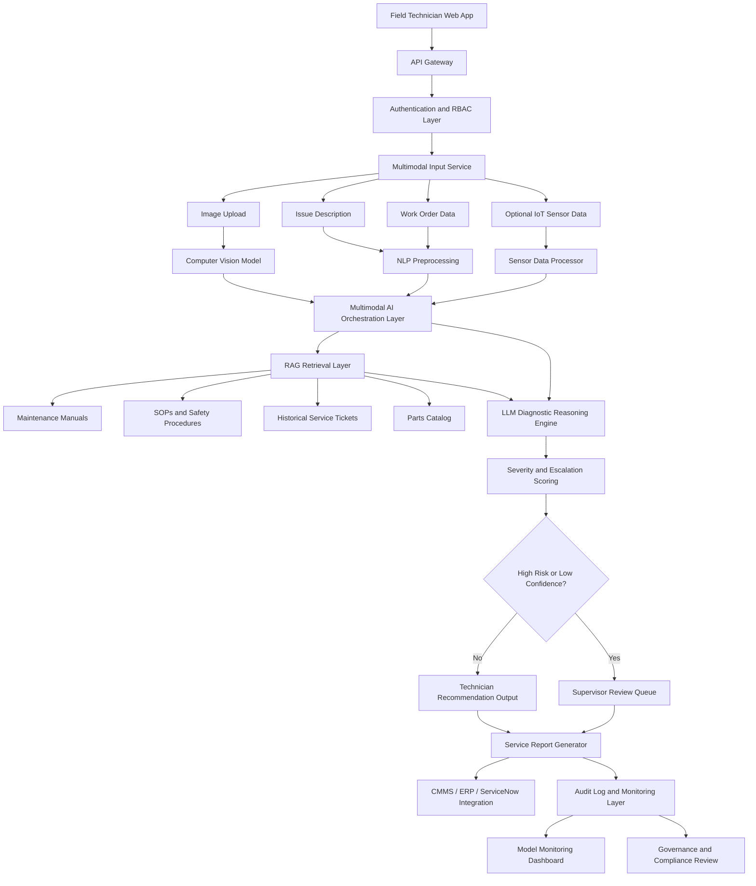
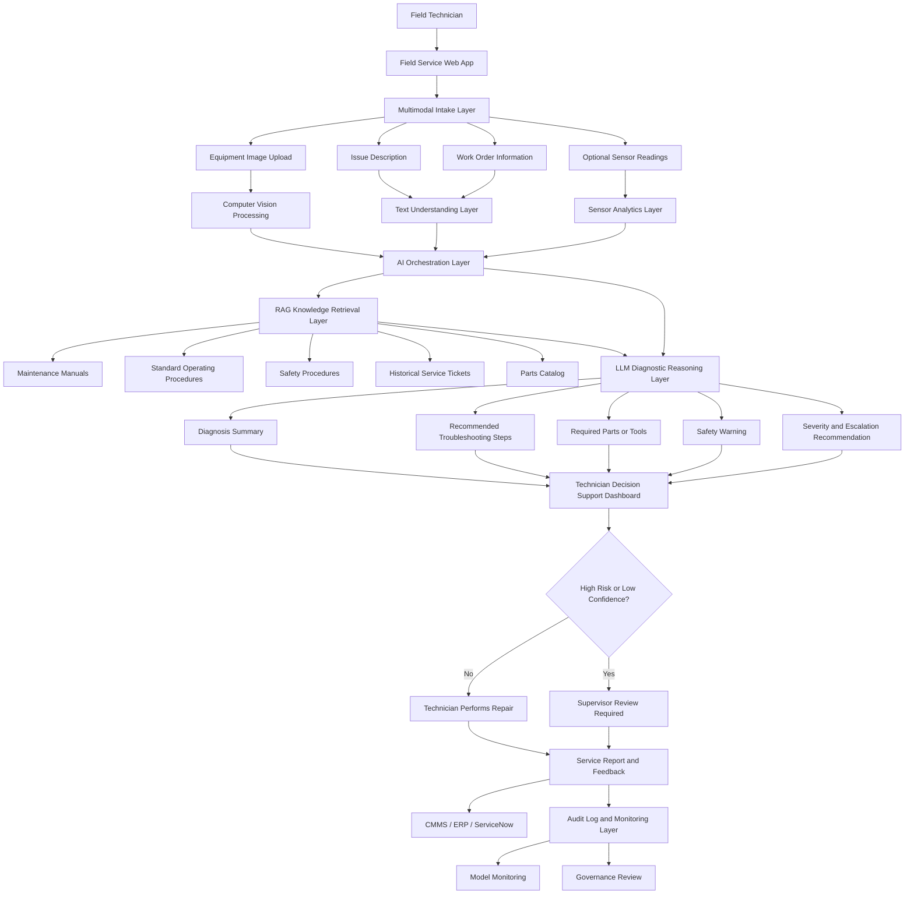
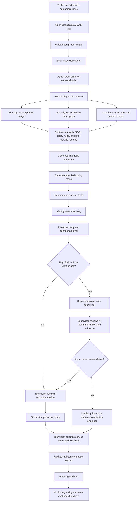
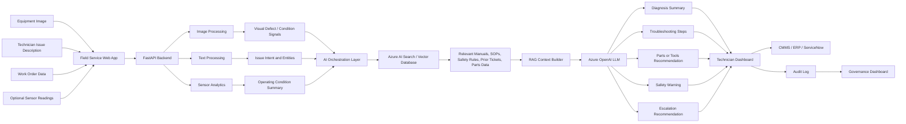
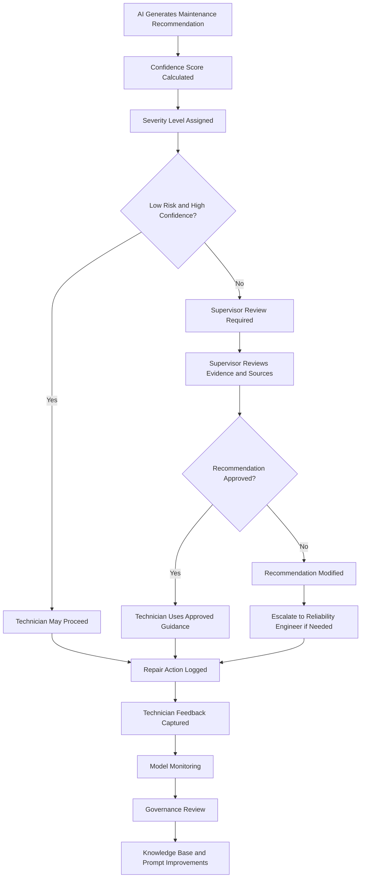

# CognitOps AI: Multimodal Field Service Intelligence Platform

## Project Overview

CognitOps AI is a multimodal AI-powered field service and maintenance platform designed to help technicians diagnose equipment issues, retrieve relevant repair guidance, assess severity, recommend next actions, and escalate complex cases to human experts.

The system combines image analysis, technician text input, work order data, maintenance manuals, historical service records, retrieval-augmented generation, LLM reasoning, workflow routing, and human-in-the-loop governance into one enterprise AI architecture.

This project is designed as an enterprise AI systems architecture concept for field service and maintenance operations. The AI supports technicians, supervisors, and reliability teams while preserving human oversight, safety, auditability, and responsible AI governance.

---

## Repository Status

| Category         | Description                                                        |
| ---------------- | ------------------------------------------------------------------ |
| Project Type     | AI Systems Architecture / Multimodal AI Prototype                  |
| Business Domain  | Field Service, Maintenance, and Operations                         |
| Primary Use Case | AI-assisted equipment diagnosis and maintenance recommendation     |
| AI Pattern       | Multimodal AI + RAG + LLM Reasoning + Human-in-the-Loop Governance |
| Target Platform  | Azure                                                              |
| Status           | Architecture and MVP Design                                        |

---

## Business Problem

Field service teams often experience delays because technicians must manually search through equipment manuals, service records, inspection notes, troubleshooting procedures, and parts documentation while diagnosing issues in the field.

Common business challenges include:

* Slow equipment diagnosis
* Inconsistent troubleshooting
* Limited access to expert knowledge
* Poor documentation quality
* Reactive maintenance
* Increased downtime and repair cost
* Safety risk from incomplete or inconsistent procedures
* Limited visibility into recurring asset failures

---

## Proposed Solution

CognitOps AI allows a technician to upload an equipment image, enter a problem description, attach work order details, and optionally include sensor readings. The system processes the multimodal input, retrieves relevant maintenance knowledge, analyzes the issue, and generates a structured diagnostic recommendation.

The AI output includes:

| Output                            | Description                                                         |
| --------------------------------- | ------------------------------------------------------------------- |
| Diagnosis Summary                 | Concise explanation of the likely equipment issue                   |
| Recommended Troubleshooting Steps | Step-by-step guidance for technician action                         |
| Required Parts or Tools           | Suggested replacement parts, tools, or inspection equipment         |
| Safety Warning                    | Safety risks and required precautions                               |
| Evidence Used                     | Relevant manual sections, SOPs, service records, or sensor readings |
| Severity Score                    | Low, Medium, High, or Critical                                      |
| Escalation Recommendation         | Whether supervisor or reliability engineer review is required       |
| Confidence Level                  | Indicates how reliable the AI recommendation is                     |

High-risk, low-confidence, or safety-sensitive cases are routed to a supervisor or reliability engineer for human review before action is taken.

---

## Key AI Capabilities

| Capability                     | Purpose                                                                                     |
| ------------------------------ | ------------------------------------------------------------------------------------------- |
| Computer Vision                | Analyze uploaded equipment images for visible defects, damage, wear, or abnormal conditions |
| Natural Language Processing    | Understand technician issue descriptions, work orders, and service notes                    |
| Sensor Analytics               | Analyze optional temperature, vibration, pressure, runtime, or current readings             |
| Retrieval-Augmented Generation | Retrieve manuals, SOPs, safety procedures, historical tickets, and parts records            |
| Large Language Model Reasoning | Generate diagnosis summaries, troubleshooting steps, and maintenance recommendations        |
| Severity Classification        | Score operational risk and escalation need                                                  |
| Similarity Search              | Match current issues to historical service cases                                            |
| Human-in-the-Loop Review       | Validate high-risk, low-confidence, or safety-sensitive recommendations                     |
| MLOps Monitoring               | Track quality, drift, latency, feedback, and recommendation acceptance                      |

---

## Target Users

| User                   | Role                                                             |
| ---------------------- | ---------------------------------------------------------------- |
| Field Technician       | Uploads images, enters issue details, reviews AI recommendations |
| Maintenance Supervisor | Reviews escalated cases and approves high-risk guidance          |
| Reliability Engineer   | Analyzes repeated failures and improves maintenance strategy     |
| Operations Manager     | Monitors downtime, repair performance, and service KPIs          |
| Safety Officer         | Reviews safety warnings, incidents, and audit logs               |
| Knowledge Manager      | Maintains manuals, SOPs, and technical documentation             |
| AI Engineering Team    | Builds, deploys, monitors, and improves the system               |

---

## Business Value

CognitOps AI is designed to improve:

* Mean time to repair
* First-time fix rate
* Technician productivity
* Equipment uptime
* Repair consistency
* Safety compliance
* Maintenance knowledge reuse
* Escalation accuracy
* Operational visibility
* Auditability and governance

---

## Core Business Use Case

### Use Case Name

AI-Assisted Field Service Diagnosis and Maintenance Recommendation

### Use Case Description

A field technician encounters an equipment issue. The technician opens the CognitOps AI web app, uploads an image of the equipment, enters a description of the problem, attaches work order information, and optionally includes sensor readings.

The system analyzes the image, interprets the technician’s description, retrieves relevant manuals and historical service records, evaluates severity, recommends troubleshooting steps, identifies safety risks, and determines whether the issue should be handled by the technician or escalated to a supervisor.

---

## Functional Requirements

| ID    | Requirement                                                                                                      |
| ----- | ---------------------------------------------------------------------------------------------------------------- |
| FR-01 | The system shall allow a technician to upload an equipment image.                                                |
| FR-02 | The system shall allow a technician to enter a text description of the issue.                                    |
| FR-03 | The system shall allow a technician to attach work order details.                                                |
| FR-04 | The system shall allow optional sensor readings to be included.                                                  |
| FR-05 | The system shall process image, text, work order, and sensor inputs using multimodal AI.                         |
| FR-06 | The system shall retrieve relevant manuals, SOPs, safety procedures, parts data, and historical service records. |
| FR-07 | The system shall generate a diagnostic summary.                                                                  |
| FR-08 | The system shall recommend troubleshooting steps.                                                                |
| FR-09 | The system shall recommend required parts or tools when applicable.                                              |
| FR-10 | The system shall identify safety warnings.                                                                       |
| FR-11 | The system shall assign a severity score.                                                                        |
| FR-12 | The system shall assign a confidence level to the AI recommendation.                                             |
| FR-13 | The system shall escalate high-risk or low-confidence cases to a supervisor or reliability engineer.             |
| FR-14 | The system shall log all AI inputs, retrieved sources, outputs, confidence scores, and user actions.             |
| FR-15 | The system shall allow technician feedback to improve future recommendations.                                    |

---

## Nonfunctional Requirements

| Category        | Requirement                                                                    |
| --------------- | ------------------------------------------------------------------------------ |
| Security        | Role-based access control, encryption, and secure API access                   |
| Reliability     | System should be available for field service and maintenance teams             |
| Performance     | AI responses should return quickly enough for technician workflow use          |
| Auditability    | Every AI recommendation must be traceable to source documents and model output |
| Explainability  | Recommendations should cite relevant manuals, SOPs, or service records         |
| Scalability     | System should support multiple technicians, sites, and equipment classes       |
| Privacy         | Operational data, images, documents, and service records must be protected     |
| Governance      | Human review required for high-risk, low-confidence, or safety-sensitive cases |
| Monitoring      | Latency, failure rate, usage, model quality, and feedback must be tracked      |
| Maintainability | Knowledge base, prompts, and model versions should be version controlled       |

---

## High-Level Architecture



---

## Logical Architecture

The logical architecture shows what the system does from a business and AI capability perspective. It focuses on the major functional layers, including technician intake, multimodal AI processing, RAG retrieval, recommendation generation, escalation logic, and governance.



---

## Logical Architecture Layers

| Layer                          | Purpose                                                                                            |
| ------------------------------ | -------------------------------------------------------------------------------------------------- |
| User Interaction Layer         | Allows field technicians and supervisors to interact with the system                               |
| Multimodal Intake Layer        | Captures equipment images, issue descriptions, work order details, and sensor readings             |
| Computer Vision Layer          | Analyzes uploaded equipment images for visible defects, damage, wear, or abnormal conditions       |
| Text Understanding Layer       | Interprets technician notes, issue descriptions, and work order details                            |
| Sensor Analytics Layer         | Reviews optional IoT or machine readings such as temperature, vibration, pressure, and runtime     |
| AI Orchestration Layer         | Coordinates image analysis, text analysis, retrieval, reasoning, scoring, and workflow routing     |
| RAG Knowledge Retrieval Layer  | Retrieves relevant manuals, SOPs, safety rules, historical cases, and parts information            |
| LLM Diagnostic Reasoning Layer | Generates diagnosis summaries, repair guidance, safety warnings, and next-best actions             |
| Decision Support Layer         | Presents structured recommendations to technicians and supervisors                                 |
| Human Review Layer             | Routes high-risk or low-confidence cases to supervisors before action is taken                     |
| System of Record Layer         | Saves final service notes, recommendations, and repair outcomes to operational systems             |
| Governance Layer               | Tracks inputs, outputs, source evidence, confidence, model versions, user feedback, and audit logs |

---

## Logical Architecture Summary

The logical architecture is designed around technician decision support, not full automation.

CognitOps AI helps technicians diagnose equipment issues faster by combining visual evidence, technician notes, service history, maintenance documentation, and optional sensor readings. The system retrieves relevant knowledge, generates a diagnostic recommendation, scores severity, identifies safety risks, and determines whether the case should be handled by the technician or escalated to a supervisor.

This approach keeps human experts in control while improving consistency, speed, safety, and auditability across field service operations.

---

## Physical Architecture

The physical architecture shows how CognitOps AI can be deployed using Azure services. It translates the logical design into real infrastructure components for hosting, APIs, storage, AI models, vector search, monitoring, governance, and CI/CD.

```mermaid
flowchart TB
    A[Field Technician Browser or Mobile Device] --> B[Azure App Service / Streamlit or React Frontend]

    B --> C[Azure API Management]
    C --> D[FastAPI Backend Container]

    D --> E[Microsoft Entra ID]
    D --> F[Azure Blob Storage]
    D --> G[Azure SQL Database]
    D --> H[Azure AI Search]
    D --> I[Azure OpenAI Service]
    D --> J[Azure Functions]

    F --> F1[Uploaded Equipment Images]
    F --> F2[Maintenance Manuals and SOP PDFs]
    F --> F3[Service Report Attachments]

    G --> G1[Asset Metadata]
    G --> G2[Maintenance Case Records]
    G --> G3[Sensor Reading Summaries]
    G --> G4[AI Output Records]
    G --> G5[Human Review Decisions]

    H --> H1[Vector Index]
    H --> H2[Keyword Index]
    H --> H3[Manual / SOP / Ticket Chunks]

    I --> I1[Vision-Capable Model]
    I --> I2[LLM Diagnostic Reasoning Model]
    I --> I3[Embedding Model]

    J --> J1[Document Ingestion Job]
    J --> J2[Embedding Pipeline]
    J --> J3[Scheduled Monitoring Job]

    D --> K[CMMS / ERP / ServiceNow Integration]
    D --> L[Optional IoT / Sensor Data Source]
    D --> M[Parts Inventory System]

    D --> N[Application Insights]
    D --> O[Azure Monitor]
    D --> P[Azure Key Vault]

    N --> Q[Operations Dashboard]
    O --> Q

    D --> R[Audit Log Storage]
    R --> S[Governance Dashboard]

    T[GitHub Repository] --> U[GitHub Actions CI/CD]
    U --> B
    U --> D
```



---

## Physical Architecture Components

| Physical Component         | Recommended Service                            | Purpose                                                                         |
| -------------------------- | ---------------------------------------------- | ------------------------------------------------------------------------------- |
| Frontend Web App           | Azure App Service, Streamlit, or React         | Interface for technicians and supervisors                                       |
| API Gateway                | Azure API Management                           | Secures, manages, and monitors API traffic                                      |
| Backend API                | FastAPI on Azure Container Apps or App Service | Handles orchestration, business logic, and AI calls                             |
| Authentication             | Microsoft Entra ID                             | Provides role-based access for technicians, supervisors, engineers, and admins  |
| Image and Document Storage | Azure Blob Storage                             | Stores uploaded equipment images, manuals, SOPs, and service documents          |
| Structured Database        | Azure SQL Database or PostgreSQL               | Stores assets, work orders, maintenance cases, AI outputs, and review decisions |
| Vector Search              | Azure AI Search or FAISS                       | Enables RAG over manuals, SOPs, historical tickets, and parts documentation     |
| Vision Model               | Azure OpenAI vision-capable model              | Analyzes equipment images and visual evidence                                   |
| LLM Reasoning Model        | Azure OpenAI Service                           | Generates diagnosis summaries, recommendations, and safety guidance             |
| Embedding Model            | Azure OpenAI Embeddings                        | Converts documents and service history into searchable vector representations   |
| Data Processing Jobs       | Azure Functions                                | Runs ingestion, chunking, embedding, and scheduled monitoring workflows         |
| Secret Management          | Azure Key Vault                                | Stores API keys, credentials, and connection strings securely                   |
| Monitoring                 | Azure Monitor and Application Insights         | Tracks latency, errors, usage, app health, and operational performance          |
| Governance Logs            | Azure SQL, Log Analytics, or Blob Storage      | Stores prompts, outputs, source evidence, model versions, and approvals         |
| CI/CD                      | GitHub Actions                                 | Builds, tests, and deploys frontend and backend services from GitHub            |

---

## Logical vs. Physical Architecture

| Architecture Type     | Focus                         | Example                                                                     |
| --------------------- | ----------------------------- | --------------------------------------------------------------------------- |
| Logical Architecture  | What the system does          | Multimodal intake, RAG retrieval, diagnostic reasoning, escalation workflow |
| Physical Architecture | Where and how the system runs | Azure App Service, FastAPI, Azure OpenAI, Azure AI Search, Azure SQL        |
| Logical Design        | Describes capabilities        | Retrieve maintenance manuals and generate repair recommendation             |
| Physical Design       | Describes infrastructure      | FastAPI calls Azure AI Search and Azure OpenAI                              |

---

## Business Workflow



---

## Data Flow Diagram



---

## Human-in-the-Loop Governance



---

## Example AI Output

| Output Field        | Example Response                                                                                                              |
| ------------------- | ----------------------------------------------------------------------------------------------------------------------------- |
| Diagnosis Summary   | Possible bearing wear, belt misalignment, or motor mount instability.                                                         |
| Evidence Used       | Uploaded image, technician description, prior service ticket, and motor maintenance manual.                                   |
| Recommended Action  | Power down equipment, follow lockout/tagout, inspect belt tension, check bearing condition, and verify motor mount alignment. |
| Required Tools      | Lockout/tagout kit, vibration meter, belt tension gauge, bearing inspection tool.                                             |
| Parts Needed        | Replacement bearing, drive belt, lubricant.                                                                                   |
| Safety Warning      | Do not inspect while the motor is powered. Follow lockout/tagout procedure before maintenance.                                |
| Severity Score      | High                                                                                                                          |
| Escalation Decision | Supervisor review required.                                                                                                   |
| Confidence Level    | Medium                                                                                                                        |

---

## MVP Scope

The first version should focus on a working prototype that demonstrates the full architecture without requiring enterprise system integration.

| Feature                        | MVP Scope          |
| ------------------------------ | ------------------ |
| Technician web form            | Included           |
| Equipment image upload         | Included           |
| Issue description input        | Included           |
| Work order input               | Included           |
| Maintenance manual retrieval   | Included           |
| AI-generated diagnosis         | Included           |
| Troubleshooting recommendation | Included           |
| Safety warning generation      | Included           |
| Severity score                 | Included           |
| Confidence score               | Included           |
| Escalation recommendation      | Included           |
| Human review simulation        | Included           |
| Audit log table                | Included           |
| Live IoT integration           | Future enhancement |
| Full CMMS integration          | Future enhancement |
| Real-time video inspection     | Future enhancement |

---

## Dataset Files

The project includes synthetic CSV datasets that support the MVP and architecture demonstration.

| Dataset                   | Purpose                                                                                     |
| ------------------------- | ------------------------------------------------------------------------------------------- |
| `equipment_assets.csv`    | Master asset inventory for field service equipment                                          |
| `maintenance_cases.csv`   | Historical and active maintenance cases with issue descriptions and AI outputs              |
| `sensor_readings.csv`     | Simulated IoT readings for temperature, vibration, pressure, current, and anomaly detection |
| `parts_inventory.csv`     | Parts catalog with stock, cost, supplier, and reorder details                               |
| `manual_index.csv`        | RAG-ready document index for manuals, SOPs, and troubleshooting sections                    |
| `technician_feedback.csv` | Technician feedback used for AI monitoring and quality improvement                          |

Recommended repository structure:

```text
cognitops-ai/
├── README.md
├── data/
│   ├── equipment_assets.csv
│   ├── maintenance_cases.csv
│   ├── sensor_readings.csv
│   ├── parts_inventory.csv
│   ├── manual_index.csv
│   └── technician_feedback.csv
├── docs/
├── diagrams/
├── src/
├── infra/
├── k8s/
└── scripts/
```

---

## Suggested Technology Stack

| Layer          | Recommended Tool                                              |
| -------------- | ------------------------------------------------------------- |
| Frontend       | Streamlit for MVP; React for enterprise version               |
| Backend        | FastAPI                                                       |
| AI Model       | Azure OpenAI vision-capable model                             |
| RAG Search     | Azure AI Search or FAISS                                      |
| Embeddings     | Azure OpenAI Embeddings                                       |
| Database       | Azure SQL Database or PostgreSQL                              |
| File Storage   | Azure Blob Storage                                            |
| Authentication | Microsoft Entra ID                                            |
| Workflow       | FastAPI workflow logic, Power Automate, or ServiceNow         |
| Monitoring     | Azure Monitor, Application Insights, MLflow                   |
| Deployment     | Azure App Service, Azure Container Apps, or AKS               |
| CI/CD          | GitHub Actions                                                |
| Governance     | Audit logs, human review queue, prompt/model version tracking |

---

## Success Metrics and KPIs

| KPI                            | Measurement                                                      |
| ------------------------------ | ---------------------------------------------------------------- |
| Mean Time to Repair            | Reduction in average repair time                                 |
| First-Time Fix Rate            | Increase in issues resolved on first visit                       |
| Equipment Downtime             | Reduction in downtime hours                                      |
| Escalation Accuracy            | Percentage of cases correctly routed to supervisors or engineers |
| Technician Productivity        | Number of cases completed per technician                         |
| Recommendation Acceptance Rate | Percentage of AI recommendations accepted by users               |
| Safety Incident Reduction      | Reduction in maintenance-related safety incidents                |
| Knowledge Retrieval Accuracy   | Percentage of responses citing correct manuals or SOPs           |
| AI Response Latency            | Time required to generate a recommendation                       |
| User Feedback Score            | Technician rating of AI usefulness                               |

---

## Risks and Mitigation Strategy

| Risk                                   | Mitigation                                                               |
| -------------------------------------- | ------------------------------------------------------------------------ |
| AI gives incorrect repair guidance     | Require source citations and human review for high-risk cases            |
| AI hallucinates technical instructions | Use RAG grounded in approved manuals, SOPs, and service records          |
| Poor image quality                     | Add image validation and resubmission prompts                            |
| Sensitive operational data exposure    | Use encryption, RBAC, secure storage, and access logging                 |
| Overreliance on AI                     | Keep AI as decision support, not final decision-maker                    |
| Outdated manuals                       | Use document version control and scheduled knowledge base updates        |
| Model drift                            | Monitor feedback, recommendation acceptance, latency, and issue patterns |
| Unsafe recommendation                  | Add safety rules, escalation logic, and supervisor review                |
| Inconsistent technician usage          | Provide standardized workflows and clear recommendation format           |
| Poor source retrieval                  | Track retrieval accuracy and improve chunking, metadata, and indexing    |

---

## Governance and Security Requirements

| Governance Area  | Requirement                                                                                   |
| ---------------- | --------------------------------------------------------------------------------------------- |
| Human Oversight  | High-risk and low-confidence cases require supervisor or reliability engineer review          |
| Auditability     | Store inputs, outputs, retrieved sources, confidence scores, model versions, and user actions |
| Explainability   | Recommendations must cite relevant manuals, SOPs, or service records                          |
| Access Control   | Technicians, supervisors, engineers, admins, and reviewers should have different permissions  |
| Data Security    | Encrypt uploaded images, documents, logs, equipment data, and service records                 |
| Model Monitoring | Track latency, errors, feedback, hallucination risk, and retrieval accuracy                   |
| Version Control  | Track manuals, SOPs, prompts, models, and knowledge base updates                              |
| Safety Review    | Review escalated cases and AI-generated guidance for operational safety risk                  |
| Feedback Loop    | Capture technician feedback to improve prompts, retrieval, and knowledge base quality         |

---

## Future Enhancements

* Live CMMS integration
* Live ERP integration
* Real-time IoT sensor ingestion
* Predictive maintenance forecasting
* Technician mobile app
* Voice input for technician notes
* Real-time video inspection
* Automated parts ordering recommendation
* Reliability engineering dashboard
* Supervisor review dashboard
* Safety compliance dashboard
* Power BI executive reporting
* Azure ML model monitoring
* ServiceNow, SAP, or IBM Maximo integration

---

## Professional Project Summary

CognitOps AI is an enterprise-grade multimodal AI architecture project that demonstrates how equipment images, technician issue descriptions, work order data, sensor readings, maintenance manuals, SOPs, historical service records, and parts information can be combined into an AI-powered decision support platform for field service and maintenance operations.

The logical architecture shows how the system supports field service through multimodal intake, computer vision, text understanding, sensor analytics, RAG-based knowledge retrieval, LLM diagnostic reasoning, human review, and governance. The physical architecture translates that design into a deployable Azure-based solution using Azure App Service, FastAPI, Azure OpenAI, Azure AI Search, Azure SQL Database, Blob Storage, Key Vault, Application Insights, Azure Monitor, and GitHub Actions.

The platform is designed to improve technician productivity, repair consistency, equipment uptime, safety compliance, escalation accuracy, knowledge reuse, and operational visibility while keeping humans responsible for final high-risk maintenance decisions.

