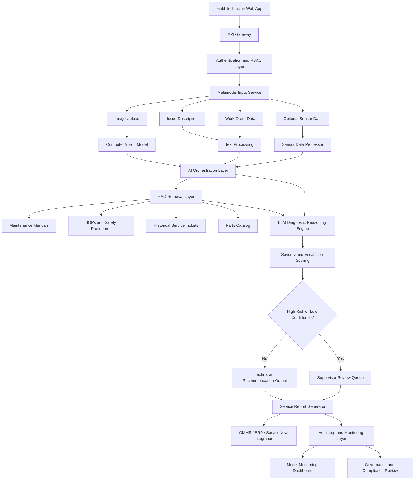

# CognitOps AI: Multimodal Maintenance Triage Assistant

## Overview

CognitOps AI is an enterprise-grade multimodal AI solution designed to support maintenance triage and field service decision-making. The system helps technicians diagnose equipment issues by combining uploaded equipment images, issue descriptions, work order context, maintenance documentation, historical service records, and AI-generated recommendations.

The solution uses computer vision, retrieval-augmented generation, LLM reasoning, severity scoring, safety validation, and human-in-the-loop review to improve repair consistency, reduce downtime, and support safer maintenance decisions.

CognitOps AI is designed as a decision-support system. It assists technicians and supervisors but does not replace human judgment for high-risk maintenance actions.

---

## Solution Objective

The objective of CognitOps AI is to help field service and maintenance teams reduce diagnostic time, improve troubleshooting quality, and route high-risk cases to the right human reviewer.

The initial release focuses on one core workflow:

> A technician uploads an equipment image, enters an issue description, and receives an AI-assisted diagnosis summary, troubleshooting recommendation, safety warning, severity score, and escalation decision.

---

## Operational Problem

Maintenance teams often lose time because critical troubleshooting knowledge is spread across manuals, SOPs, prior service tickets, parts records, and expert experience. When technicians are in the field, they may need to make decisions quickly without full context.

Common operational challenges include:

* Slow equipment diagnosis
* Inconsistent troubleshooting across technicians
* Manual search through maintenance documentation
* Limited access to prior service history
* Delayed escalation of high-risk cases
* Safety risk from incomplete procedures
* Poor documentation after repairs
* Limited visibility into recurring failure patterns

---

## Solution Approach

CognitOps AI provides a structured AI-assisted triage workflow.

The technician submits an equipment image, issue description, and optional work order or sensor context. The platform analyzes the input, retrieves relevant maintenance knowledge, generates a diagnostic recommendation, assigns severity and confidence scores, and determines whether supervisor review is required.

| AI Output                    | Purpose                                              |
| ---------------------------- | ---------------------------------------------------- |
| Diagnosis Summary            | Summarizes the likely equipment issue                |
| Troubleshooting Steps        | Provides recommended next actions                    |
| Safety Warning               | Identifies safety risks and required precautions     |
| Parts / Tools Recommendation | Suggests likely parts or tools needed                |
| Severity Score               | Classifies operational risk                          |
| Confidence Level             | Indicates reliability of the AI recommendation       |
| Escalation Decision          | Determines whether human review is required          |
| Evidence Used                | Shows manuals, SOPs, records, or sensor context used |

---

## Core Capabilities

| Capability               | Description                                                                                |
| ------------------------ | ------------------------------------------------------------------------------------------ |
| Multimodal Intake        | Accepts equipment images, text descriptions, work order data, and optional sensor readings |
| Computer Vision          | Analyzes equipment images for visible defects, damage, wear, or abnormal conditions        |
| Text Understanding       | Interprets technician notes and issue descriptions                                         |
| RAG Knowledge Retrieval  | Retrieves relevant manuals, SOPs, safety procedures, parts records, and service history    |
| LLM Diagnostic Reasoning | Generates diagnosis summaries and troubleshooting guidance                                 |
| Severity Scoring         | Classifies cases by urgency and operational risk                                           |
| Safety Validation        | Flags safety-sensitive work and required precautions                                       |
| Human Review Routing     | Sends high-risk or low-confidence cases to supervisors                                     |
| Audit Logging            | Records inputs, outputs, evidence, confidence scores, and human decisions                  |
| Monitoring               | Tracks latency, recommendation quality, feedback, and system usage                         |

---

## Target Users

| User Group              | Responsibility                                                                  |
| ----------------------- | ------------------------------------------------------------------------------- |
| Field Technicians       | Submit issues, review AI recommendations, perform repairs, and provide feedback |
| Maintenance Supervisors | Review escalated cases and approve high-risk recommendations                    |
| Reliability Engineers   | Analyze recurring failures and improve maintenance strategy                     |
| Operations Managers     | Monitor downtime, service performance, and operational KPIs                     |
| Safety Officers         | Review safety warnings, incidents, and compliance patterns                      |
| AI Engineering Team     | Deploy, monitor, secure, and improve the AI platform                            |

---

## High-Level Architecture



---

## Initial Release Scope

The initial release is scoped to a focused, buildable workflow for AI-assisted maintenance triage.

| Capability                         | Status         |
| ---------------------------------- | -------------- |
| Technician web form                | Included       |
| Equipment image upload             | Included       |
| Issue description input            | Included       |
| Work order context                 | Included       |
| Maintenance manual retrieval       | Included       |
| AI-generated diagnosis summary     | Included       |
| Troubleshooting recommendation     | Included       |
| Safety warning                     | Included       |
| Severity score                     | Included       |
| Confidence score                   | Included       |
| Supervisor review flag             | Included       |
| Audit log table                    | Included       |
| Live IoT integration               | Future release |
| Full CMMS / ERP integration        | Future release |
| Real-time video inspection         | Future release |
| Predictive maintenance forecasting | Future release |

---

## Reference Implementation Stack

| Layer          | Technology                                                        |
| -------------- | ----------------------------------------------------------------- |
| Frontend       | Streamlit for initial release; React for enterprise UI            |
| Backend        | FastAPI                                                           |
| AI Model       | Azure OpenAI vision-capable model                                 |
| RAG Search     | Azure AI Search or FAISS                                          |
| Embeddings     | Azure OpenAI Embeddings                                           |
| Database       | Azure SQL Database or PostgreSQL                                  |
| File Storage   | Azure Blob Storage                                                |
| Authentication | Microsoft Entra ID                                                |
| Monitoring     | Azure Monitor, Application Insights, MLflow                       |
| Deployment     | Azure App Service, Azure Container Apps, or AKS                   |
| CI/CD          | GitHub Actions                                                    |
| Governance     | Audit logs, human review queue, prompt and model version tracking |

---

## Data Assets

The repository includes synthetic operational datasets to support the prototype workflow.

| Dataset                   | Purpose                                                         |
| ------------------------- | --------------------------------------------------------------- |
| `equipment_assets.csv`    | Asset inventory for field service equipment                     |
| `maintenance_cases.csv`   | Historical and active maintenance cases                         |
| `sensor_readings.csv`     | Simulated machine readings for anomaly detection                |
| `parts_inventory.csv`     | Parts catalog with stock, supplier, and cost information        |
| `manual_index.csv`        | RAG-ready index for manuals, SOPs, and troubleshooting sections |
| `technician_feedback.csv` | Technician feedback for monitoring recommendation quality       |

Recommended repository structure:

```text
Cognitops-AI/
├── README.md
├── data/
│   ├── equipment_assets.csv
│   ├── maintenance_cases.csv
│   ├── sensor_readings.csv
│   ├── parts_inventory.csv
│   ├── manual_index.csv
│   └── technician_feedback.csv
├── docs/
├── diagrams/
├── src/
├── infra/
├── k8s/
└── scripts/
```

---

## Example AI-Assisted Triage Output

| Output Field        | Example Response                                                                                                             |
| ------------------- | ---------------------------------------------------------------------------------------------------------------------------- |
| Diagnosis Summary   | Possible bearing wear, belt misalignment, or motor mount instability                                                         |
| Evidence Used       | Uploaded image, technician description, prior service ticket, and motor maintenance manual                                   |
| Recommended Action  | Power down equipment, follow lockout/tagout, inspect belt tension, check bearing condition, and verify motor mount alignment |
| Required Tools      | Lockout/tagout kit, vibration meter, belt tension gauge, bearing inspection tool                                             |
| Parts Needed        | Replacement bearing, drive belt, lubricant                                                                                   |
| Safety Warning      | Do not inspect while the motor is powered. Follow lockout/tagout procedure before maintenance                                |
| Severity Score      | High                                                                                                                         |
| Escalation Decision | Supervisor review required                                                                                                   |
| Confidence Level    | Medium                                                                                                                       |

---

## Operating Metrics

| Metric                         | Measurement                                                                  |
| ------------------------------ | ---------------------------------------------------------------------------- |
| Mean Time to Repair            | Reduction in average repair time                                             |
| First-Time Fix Rate            | Increase in issues resolved on the first visit                               |
| Equipment Downtime             | Reduction in downtime hours                                                  |
| Escalation Accuracy            | Percentage of cases correctly routed to supervisors or reliability engineers |
| Recommendation Acceptance Rate | Percentage of AI recommendations accepted by users                           |
| Safety Incident Reduction      | Reduction in maintenance-related safety incidents                            |
| Knowledge Retrieval Accuracy   | Percentage of responses citing correct manuals or SOPs                       |
| AI Response Latency            | Time required to generate a recommendation                                   |

---

## Governance and Risk Controls

| Risk                                | Control                                                                  |
| ----------------------------------- | ------------------------------------------------------------------------ |
| Incorrect repair guidance           | Require source citations and human review for high-risk cases            |
| Hallucinated technical instructions | Ground recommendations in approved manuals, SOPs, and service records    |
| Poor image quality                  | Validate uploads and request resubmission when needed                    |
| Sensitive operational data exposure | Use encryption, RBAC, secure storage, and access logging                 |
| Overreliance on AI                  | Keep AI as decision support, not final authority                         |
| Outdated manuals                    | Use document version control and scheduled knowledge base updates        |
| Unsafe recommendation               | Apply safety rules, escalation logic, and supervisor review              |
| Model drift                         | Monitor feedback, latency, source quality, and recommendation acceptance |

---

## Roadmap

| Phase   | Focus                                                                                                            |
| ------- | ---------------------------------------------------------------------------------------------------------------- |
| Phase 1 | Maintenance triage assistant with image upload, issue description, RAG, recommendation output, and audit logging |
| Phase 2 | Supervisor review queue, enhanced safety controls, and technician feedback loop                                  |
| Phase 3 | CMMS / ERP / ServiceNow integration and parts inventory lookup                                                   |
| Phase 4 | IoT sensor ingestion and predictive maintenance risk scoring                                                     |
| Phase 5 | Mobile technician app, real-time inspection, reliability engineering dashboard, and executive reporting          |

---

## Documentation

Additional architecture, governance, and implementation details can be maintained in the `/docs` folder as the solution expands.

Recommended documents:

* `docs/architecture.md`
* `docs/governance.md`
* `docs/data-design.md`
* `docs/deployment-plan.md`
* `docs/roadmap.md`

---

## Professional Summary

CognitOps AI demonstrates how multimodal AI can support maintenance triage and field service operations through image understanding, technician note interpretation, RAG-based maintenance knowledge retrieval, LLM diagnostic reasoning, severity scoring, safety validation, and human-in-the-loop governance.

The initial release is scoped to a focused operational workflow: helping technicians diagnose equipment issues faster and route risky cases to human review. The reference architecture shows how the solution can scale into a full enterprise field service intelligence platform using Azure App Service, FastAPI, Azure OpenAI, Azure AI Search, Azure SQL Database, Blob Storage, Key Vault, Azure Monitor, Application Insights, and GitHub Actions.


