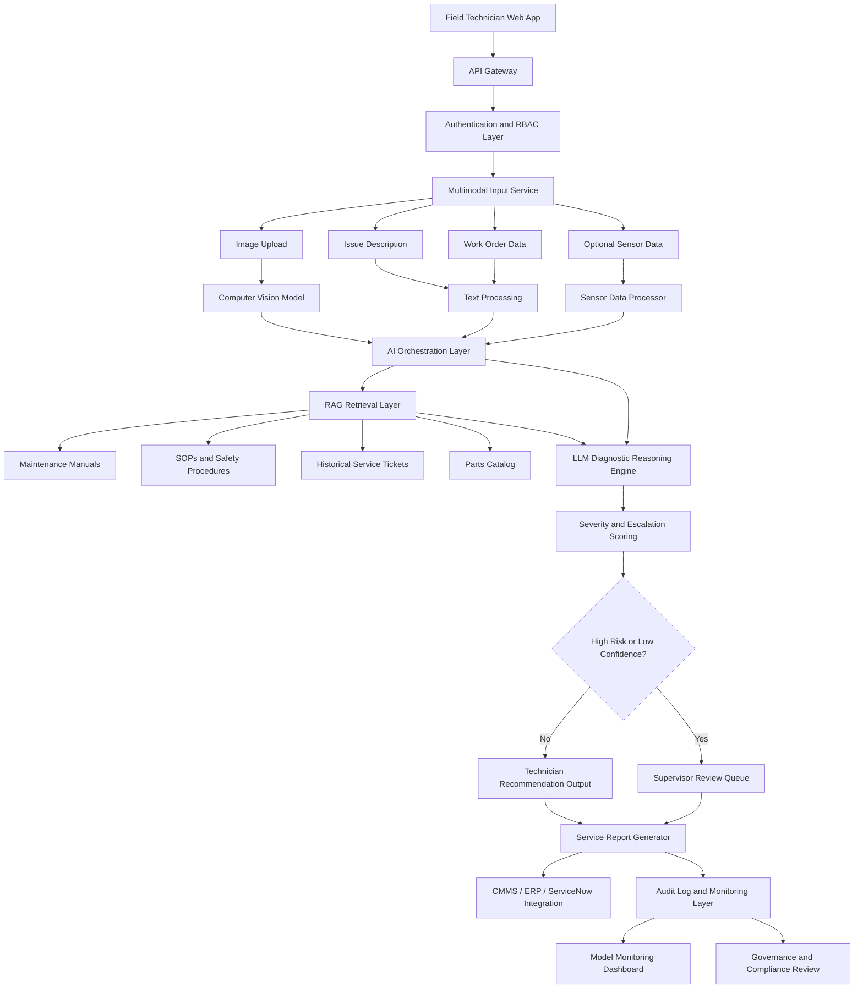

# CognitOps AI: Multimodal Maintenance Triage Platform

## Executive Overview

CognitOps AI is an enterprise multimodal AI platform that helps maintenance teams triage equipment issues faster and more consistently. The system analyzes equipment images, technician issue descriptions, work order context, and maintenance documentation to generate AI-assisted diagnosis summaries, troubleshooting recommendations, safety warnings, severity scores, and escalation decisions.

The platform combines computer vision, retrieval-augmented generation, LLM reasoning, severity classification, safety validation, audit logging, and human-in-the-loop governance into a scalable architecture for field service and maintenance operations.

CognitOps AI is designed as a decision-support platform. It does not replace technicians, supervisors, or reliability engineers. It improves diagnostic speed, repair consistency, safety awareness, and operational traceability while keeping humans accountable for high-risk maintenance decisions.

---

## Solution Status

| Category        | Description                                                          |
| --------------- | -------------------------------------------------------------------- |
| Solution Type   | Enterprise AI Solution Architecture                                  |
| Business Domain | Field Service, Maintenance, and Operations                           |
| Core Capability | Multimodal maintenance triage and technician decision support        |
| AI Pattern      | Computer Vision + RAG + LLM Reasoning + Human-in-the-Loop Governance |
| Target Platform | Azure                                                                |
| Release Focus   | Initial release architecture and reference implementation            |

---

## Contents

* [Operational Problem](#operational-problem)
* [Solution Objective](#solution-objective)
* [Solution Approach](#solution-approach)
* [Core Platform Capabilities](#core-platform-capabilities)
* [Target Operating Users](#target-operating-users)
* [High-Level Architecture](#high-level-architecture)
* [Initial Release Scope](#initial-release-scope)
* [Reference Implementation Stack](#reference-implementation-stack)
* [Data Assets](#data-assets)
* [Example AI-Assisted Triage Output](#example-ai-assisted-triage-output)
* [Operating Metrics](#operating-metrics)
* [Governance and Risk Controls](#governance-and-risk-controls)
* [Roadmap](#roadmap)
* [Documentation](#documentation)
* [Professional Summary](#professional-summary)

---

## Operational Problem

Maintenance and field service teams often lose time because troubleshooting knowledge is fragmented across equipment manuals, SOPs, prior service tickets, parts documentation, sensor readings, and expert experience. In the field, technicians need fast, consistent, and evidence-based guidance to make safe maintenance decisions.

Common operational challenges include:

* Slow initial diagnosis of equipment issues
* Inconsistent troubleshooting across technicians and locations
* Manual search through manuals, SOPs, and prior service tickets
* Limited access to historical maintenance context
* Delayed escalation of high-risk or uncertain cases
* Safety risk from incomplete or inconsistent procedures
* Poor post-repair documentation quality
* Limited visibility into recurring equipment failure patterns

---

## Solution Objective

The objective of CognitOps AI is to reduce diagnostic friction in maintenance operations by giving field technicians faster access to relevant repair guidance, safety procedures, service history, and escalation logic.

The initial release focuses on one high-value operational workflow:

> A technician uploads an equipment image, enters an issue description, and receives an AI-assisted diagnosis summary, troubleshooting recommendation, safety warning, severity score, confidence level, and escalation decision.

The architecture is designed to scale beyond the initial release into CMMS integration, IoT telemetry, predictive maintenance, mobile field service workflows, and reliability engineering analytics.

---

## Solution Approach

CognitOps AI provides an AI-assisted maintenance triage workflow.

A technician submits an equipment image, issue description, work order context, and optional sensor readings. The platform analyzes the multimodal input, retrieves relevant maintenance knowledge, generates a diagnostic recommendation, assigns severity and confidence scores, and determines whether the case can proceed or requires supervisor review.

| AI Output                    | Purpose                                                         |
| ---------------------------- | --------------------------------------------------------------- |
| Diagnosis Summary            | Summarizes the likely equipment issue                           |
| Troubleshooting Steps        | Provides recommended next actions                               |
| Safety Warning               | Identifies hazards, precautions, or lockout/tagout requirements |
| Parts / Tools Recommendation | Suggests likely parts, tools, or inspection equipment           |
| Severity Score               | Classifies operational risk                                     |
| Confidence Level             | Indicates reliability of the AI recommendation                  |
| Escalation Decision          | Determines whether human review is required                     |
| Evidence Used                | Shows manuals, SOPs, records, or sensor context used by the AI  |

---

## Core Platform Capabilities

| Capability               | Description                                                                                 |
| ------------------------ | ------------------------------------------------------------------------------------------- |
| Multimodal Intake        | Accepts equipment images, issue descriptions, work order data, and optional sensor readings |
| Computer Vision          | Analyzes equipment images for visible defects, damage, wear, or abnormal conditions         |
| Text Understanding       | Interprets technician notes, issue descriptions, and work order context                     |
| RAG Knowledge Retrieval  | Retrieves relevant manuals, SOPs, safety procedures, parts records, and service history     |
| LLM Diagnostic Reasoning | Generates diagnosis summaries and troubleshooting guidance                                  |
| Severity Classification  | Scores cases by urgency and operational risk                                                |
| Safety Validation        | Flags safety-sensitive work and required precautions                                        |
| Human Review Routing     | Sends high-risk or low-confidence cases to supervisors or reliability engineers             |
| Audit Logging            | Records inputs, outputs, evidence, confidence scores, model versions, and human decisions   |
| Monitoring               | Tracks latency, recommendation quality, retrieval performance, feedback, and system usage   |

---

## Target Operating Users

| User Group              | Responsibility                                                               |
| ----------------------- | ---------------------------------------------------------------------------- |
| Field Technicians       | Submit issues, review recommendations, perform repairs, and provide feedback |
| Maintenance Supervisors | Review escalated cases and approve high-risk recommendations                 |
| Reliability Engineers   | Analyze recurring failures and improve maintenance strategy                  |
| Operations Managers     | Monitor downtime, repair performance, and operational KPIs                   |
| Safety Officers         | Review safety warnings, incidents, and compliance patterns                   |
| Knowledge Managers      | Maintain manuals, SOPs, troubleshooting documentation, and knowledge sources |
| AI Engineering Team     | Deploy, monitor, secure, and continuously improve the AI platform            |

---

## High-Level Architecture



---

## Initial Release Scope

The initial release is scoped to a focused operational workflow: AI-assisted maintenance triage.

| Capability                         | Release Status |
| ---------------------------------- | -------------- |
| Technician web form                | Included       |
| Equipment image upload             | Included       |
| Issue description input            | Included       |
| Work order context                 | Included       |
| Maintenance manual retrieval       | Included       |
| AI-generated diagnosis summary     | Included       |
| Troubleshooting recommendation     | Included       |
| Safety warning                     | Included       |
| Severity score                     | Included       |
| Confidence score                   | Included       |
| Supervisor review flag             | Included       |
| Audit log table                    | Included       |
| Live IoT integration               | Future release |
| Full CMMS / ERP integration        | Future release |
| Real-time video inspection         | Future release |
| Predictive maintenance forecasting | Future release |
| Technician mobile app              | Future release |

---

## Reference Implementation Stack

| Layer          | Technology                                                                                 |
| -------------- | ------------------------------------------------------------------------------------------ |
| Frontend       | Streamlit for initial release; React for enterprise UI                                     |
| Backend        | FastAPI                                                                                    |
| AI Model       | Azure OpenAI vision-capable model                                                          |
| RAG Search     | Azure AI Search or FAISS                                                                   |
| Embeddings     | Azure OpenAI Embeddings                                                                    |
| Database       | Azure SQL Database or PostgreSQL                                                           |
| File Storage   | Azure Blob Storage                                                                         |
| Authentication | Microsoft Entra ID                                                                         |
| Workflow       | FastAPI workflow logic, Power Automate, or ServiceNow                                      |
| Monitoring     | Azure Monitor, Application Insights, MLflow                                                |
| Deployment     | Azure App Service, Azure Container Apps, or AKS                                            |
| CI/CD          | GitHub Actions                                                                             |
| Governance     | Audit logs, human review queue, prompt versioning, model versioning, and feedback tracking |

---

## Data Assets

The repository includes synthetic operational datasets to support the initial release workflow and reference implementation.

| Dataset                   | Purpose                                                         |
| ------------------------- | --------------------------------------------------------------- |
| `equipment_assets.csv`    | Asset inventory for field service equipment                     |
| `maintenance_cases.csv`   | Historical and active maintenance cases                         |
| `sensor_readings.csv`     | Simulated machine readings for anomaly detection                |
| `parts_inventory.csv`     | Parts catalog with stock, supplier, and cost information        |
| `manual_index.csv`        | RAG-ready index for manuals, SOPs, and troubleshooting sections |
| `technician_feedback.csv` | Technician feedback for monitoring recommendation quality       |

Recommended repository structure:

```text
Cognitops-AI/
├── README.md
├── data/
│   ├── equipment_assets.csv
│   ├── maintenance_cases.csv
│   ├── sensor_readings.csv
│   ├── parts_inventory.csv
│   ├── manual_index.csv
│   └── technician_feedback.csv
├── docs/
├── diagrams/
├── src/
├── infra/
├── k8s/
└── scripts/
```

---

## Example AI-Assisted Triage Output

| Output Field        | Example Response                                                                                                             |
| ------------------- | ---------------------------------------------------------------------------------------------------------------------------- |
| Diagnosis Summary   | Possible bearing wear, belt misalignment, or motor mount instability                                                         |
| Evidence Used       | Uploaded image, technician description, prior service ticket, and motor maintenance manual                                   |
| Recommended Action  | Power down equipment, follow lockout/tagout, inspect belt tension, check bearing condition, and verify motor mount alignment |
| Required Tools      | Lockout/tagout kit, vibration meter, belt tension gauge, bearing inspection tool                                             |
| Parts Needed        | Replacement bearing, drive belt, lubricant                                                                                   |
| Safety Warning      | Do not inspect while the motor is powered. Follow lockout/tagout procedure before maintenance                                |
| Severity Score      | High                                                                                                                         |
| Escalation Decision | Supervisor review required                                                                                                   |
| Confidence Level    | Medium                                                                                                                       |

---

## Operating Metrics

| Metric                         | Measurement                                                                  |
| ------------------------------ | ---------------------------------------------------------------------------- |
| Mean Time to Repair            | Reduction in average repair time                                             |
| First-Time Fix Rate            | Increase in issues resolved on the first visit                               |
| Equipment Downtime             | Reduction in downtime hours                                                  |
| Escalation Accuracy            | Percentage of cases correctly routed to supervisors or reliability engineers |
| Technician Productivity        | Number of cases completed per technician                                     |
| Recommendation Acceptance Rate | Percentage of AI recommendations accepted by users                           |
| Safety Incident Reduction      | Reduction in maintenance-related safety incidents                            |
| Knowledge Retrieval Accuracy   | Percentage of responses citing correct manuals or SOPs                       |
| AI Response Latency            | Time required to generate a recommendation                                   |
| User Feedback Score            | Technician rating of AI usefulness                                           |

---

## Governance and Risk Controls

| Risk                                | Control                                                                  |
| ----------------------------------- | ------------------------------------------------------------------------ |
| Incorrect repair guidance           | Require source citations and human review for high-risk cases            |
| Hallucinated technical instructions | Ground recommendations in approved manuals, SOPs, and service records    |
| Poor image quality                  | Validate uploads and request resubmission when needed                    |
| Sensitive operational data exposure | Use encryption, RBAC, secure storage, and access logging                 |
| Overreliance on AI                  | Keep AI as decision support, not final authority                         |
| Outdated manuals                    | Use document version control and scheduled knowledge base updates        |
| Model drift                         | Monitor feedback, latency, source quality, and recommendation acceptance |
| Unsafe recommendation               | Apply safety rules, escalation logic, and supervisor review              |
| Inconsistent technician usage       | Standardize workflows and recommendation format                          |
| Poor source retrieval               | Improve chunking, metadata, indexing, and retrieval evaluation           |

---

## Roadmap

| Phase   | Focus                                                                                                            |
| ------- | ---------------------------------------------------------------------------------------------------------------- |
| Phase 1 | Maintenance triage assistant with image upload, issue description, RAG, recommendation output, and audit logging |
| Phase 2 | Supervisor review queue, enhanced safety controls, and technician feedback loop                                  |
| Phase 3 | CMMS / ERP / ServiceNow integration and parts inventory lookup                                                   |
| Phase 4 | IoT sensor ingestion and predictive maintenance risk scoring                                                     |
| Phase 5 | Mobile technician app, real-time inspection, reliability engineering dashboard, and executive reporting          |

---

## Documentation

Additional technical documentation can be maintained in the `/docs` folder as the solution expands.

Recommended documents:

* `docs/architecture.md`
* `docs/governance.md`
* `docs/data-design.md`
* `docs/deployment-plan.md`
* `docs/model-monitoring.md`
* `docs/roadmap.md`

---

## Professional Summary

CognitOps AI demonstrates a senior-level enterprise AI architecture for multimodal maintenance triage and field service decision support. The solution applies computer vision, RAG, LLM reasoning, severity classification, safety validation, audit logging, and human-in-the-loop governance to improve maintenance execution.

The initial release is scoped to a focused operational workflow: helping technicians diagnose equipment issues faster and route risky cases to human review. The reference implementation shows how the solution can scale into a full enterprise field service intelligence platform using Azure App Service, FastAPI, Azure OpenAI, Azure AI Search, Azure SQL Database, Blob Storage, Key Vault, Azure Monitor, Application Insights, and GitHub Actions.

The platform is designed to improve technician productivity, repair consistency, equipment uptime, safety compliance, escalation accuracy, knowledge reuse, and operational visibility while keeping humans accountable for final high-risk maintenance decisions.


